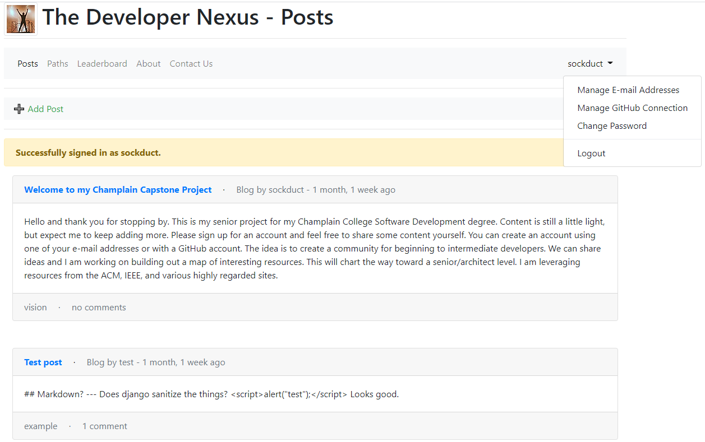

# [Bachelor's of Software Development Capstone Project](https://developernexus.herokuapp.com/)

Note:  Because this project is hosted on Heroku's free tier, it can take up to 30 seconds to spin up.

## Project Overview

This project is the culmination of my degree program with the requirements described below.  I choose to build something with [Django](https://www.djangoproject.com/) - a popular web framework that I had not worked with before.  Django is built with [Python](https://www.python.org/) as well as including [a template language](https://docs.djangoproject.com/en/dev/ref/templates/language/) and an [ORM](https://en.wikipedia.org/wiki/Object%E2%80%93relational_mapping) which allows creating [models](https://docs.djangoproject.com/en/dev/topics/db/models/) of data and letting Django deal with all aspects of the backend database.  [SQLite](https://www.sqlite.org/) was used as the development database and [PostgreSQL](https://www.postgresql.org/) is used in production.  [The Bootstrap Framework](https://getbootstrap.com/) is used to augment the frontend.

<br>

## Project Requirements

Perform full lifecycle development of a software system, including requirements analysis, designing, implementing, testing and delivery.  Project must include the following elements:

* Data - offline data storage (PostgreSQL is used)
* Verification and Validation - user input is verified and validated
* Re-usable Code - multiple examples of code re-use
* In-code Documentation - sufficiently explains code intent/workings

### Notes

* This project was created and tested on Windows 10 64-bit using Python v3.8.7/32-bit and the embedded SQLite3 database v3.33.0
* This project was deployed and tested on Heroku using Python v3.6.13/64-bit with a managed PostgreSQL database, v13.2

### Dependencies

* Top-level Python libraries used as documented in requirements.txt:

**Package** | **Version**
------------|------------
cryptography | 3.4.7
dj-database-url | 0.5.0
dj-email-url | 1.0.2
django | 3.2.3
django-allauth | 0.44.0
django-cache-url | 3.2.3
django-coverage-plugin | 1.8.0
django-crispy-forms | 1.11.2
django-debug-toolbar | 3.2.1
django-extensions | 3.1.3
environs | 9.3.2
gunicorn | 20.1.0
pipdeptree | 2.0.0
psycopg2-binary | 2.8.6
ptpython | 3.0.17
werkzeug | 2.0.1
wheel | 0.36.2
whitenoise | 5.2.0

<br>

## Installation and Configuration

### Local

Note:  Assuming a [git client](https://git-scm.com/) is already installed

* Clone [this repo](https://github.com/sockduct/dusseldorf)
  * `git clone https://github.com/sockduct/dusseldorf`
  * `cd dusseldorf`
* Install [Python](https://www.python.org/downloads/)
  * Note: Python v3.6 or later required
* Create a Python virtual environment and activate it
  * `python -m venv .venv`
  * Windows: &nbsp;`.venv\scripts\activate`
  * Linux: &nbsp;`source .venv/bin/activate`
* Install repo packages:
  * `pip install -r requirements.txt`
* Customize the environment file:
  * `cp dotenv .env`
  * Edit .env and tailor - must create at least a DJANGO_SECRET_KEY and a DJANGO_ADMIN_URL_BASE
  * For production deployments, DJANGO_DEBUG should be set to False, the DJANGO email variables need to be configured with legitimate values, and DJANGO_ADMINS should be set appropriately
* Run Django migrations:
  * `python manage.py migrate`
* Create at least one Django superuser:
  * `python manage.py createsuperuser`
* Run the local server:
  * `python manage.py runserver`

### Heroku

Note:  Assuming a local cloned repo of the project is present.  See **Local** above for details.

* Install [the Heroku CLI](https://devcenter.heroku.com/articles/heroku-cli)
* Login:
  * `heroku login`
* Create a new application:
  * `heroku create`
  * Note:  Optionally specify a unique name
* Create a PostgreSQL instance:
  * `heroku addons:create heroku-postgresql:hobby-dev`
* Configure all environment variables (everything from .env except DATABASE_URL which Heroku will configure for you):

  ```bash
  # DJANGO_DEBUG defaults to False and does not need to be set for production
  # DO NOT deploy to production with DEBUG set to True!
  heroku config:set DJANGO_SECRET_KEY='...'
  heroku cofnig:set DJANGO_ADMIN_EMAIL='...'
  ...
  ```

* Push the repo to Heroku:
  * `git push heroku master`
* Setup the database:
  * `heroku run python manage.py migrate`
* Create an admin account:
  * `heroku run python manage.py createsuperuser`
* Open the application in a browser:
  * `heroku open`

<br>

## Project Layout

Note:  A Django project consists of a collection of applications and supporting resources:

* &lt;application&gt; - Top level folder housing project application
  * migrations - database setup and configuration programs
  * admin.py - register application with Django administration site
  * apps.py - application registration and configuration
  * forms.py - (optional) custom input forms used by application
  * models.py - database model for objects used by application
  * tests.py - unit testing for application
  * urls.py - (optional) used in tandem with config/urls.py to delegate routing to the application
  * views.py - used to respond to incoming requests routed to them; responds with either a web page (HTML/CSS/JavaScript) rendered from a template or JSON/XML for API endpoints
* config - Top level folder housing Django project configuration
  * asgi.py - Setup for Python [ASGI](https://asgi.readthedocs.io/en/latest/) standard - for asynchronous applications (not currently used by this project)
  * settings.py - All project configuration settings
  * urls.py - Top level project URL routing (path to module/class)
  * wsgi.py - Setup for Python [WSGI](https://en.wikipedia.org/wiki/Web_Server_Gateway_Interface) standard - for synchronous applications (the default, most widely used, and employed by this application)
* &lt;resource&gt; - Top level folder housing resource
  * static - CSS, Fonts, Images, or JavaScript
  * staticfiles - collection of all static files used throughout the application, used for deployment
  * templates - HTML and email template files using Django's templating language

### Applications:

* accounts - Custom User model application, this user model is used for administrators and web site users
* pages - (Mostly) Static web pages except the LeaderboardPageView which queries for user stats; no models in this app
* paths - Paths have supporting Subjects which have supporting Resources; this application defines each of these, types, and how they're displayed/related; only an administrator may change this using the admin site; the admin site appears in the user menu of administrators only
* posts - Designed for user content submissions; allows a variety of post types as well as tags

<br>

## Example Site Screenshot



Note:  See also [Site Overview](docs/Final%20Application%20Walk%20Through.mp4) in the Project Documents section

<br>

## Resource Attribution

* The following resources were used in developing this project:
  * [Get Started With Django: Build a Portfolio App by Martin Breuss/Real Python](https://realpython.com/courses/django-portfolio-project/)
  * [Django for Beginners by William S. Vincent](https://djangoforbeginners.com/)
  * [Django for Professionals by William S. Vincent](https://djangoforprofessionals.com/)
  * [Django for APIs by William S. Vincent](https://djangoforapis.com/)
  * Listened to all episodes of [Django Chat](https://djangochat.com/)

<br>

## Project Documents

* [README (What you're reading!)](README.md)
* [Project Documentation](docs/Project%20Documentation.pdf)
* [Project Overview Videos](docs)
  * [Stream Project Walk Through](https://share.getcloudapp.com/NQuwj6GE)
  * [Stream Data Requirement Walk Through](https://share.getcloudapp.com/L1ud9qWK)
  * [Stream Validation Requirement Walk Through](https://share.getcloudapp.com/qGuExkLG)
  * [Stream Code Reuse Requirement Walk Through](https://share.getcloudapp.com/eDuj7Nb6)

<br>

## License

[MIT License](LICENSE)
